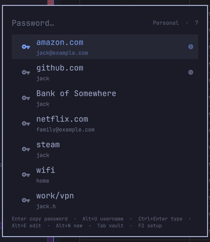

# Password Store for Omarchy

[pass](https://www.passwordstore.org/), the standard unix password manager, in
the [Omarchy](https://omarchy.org/) bar, with a setup card that takes a new
seat from "no key yet" to a synced vault, and room for more than one vault.

This is gw7523's fork of
[hegjon/omarchy-passwordstore](https://github.com/hegjon/omarchy-passwordstore)
(plugin id `io.github.gw7523.passwordstore`, cloned from
`hegjon.passwordstore`). The search card is Jonny Heggheim's; the setup
wizard, the sync backends and the vaults are what this fork adds.



- A key on the bar. Click it (or `omarchy-shell shell toggle io.github.gw7523.passwordstore '{}'`
  from a keybinding) and type to search your store; `ghb` finds
  `web/github.com`.
- Each row is the site or account name with the username under it, and the
  search matches both.
- `Enter` copies the password, `Alt+U` the username, `Alt+O` a fresh OTP code
  (with [pass-otp](https://github.com/tadfisher/pass-otp)). `Ctrl+Enter` types
  the password into the window you came from, `Ctrl+Shift+Enter` the username.
- `Alt+N` adds an entry and `Alt+E` edits one, on the card: name, username,
  a masked password field that takes a paste, reveals with each character
  class in its own colour and generates one to your length and classes,
  notes, and when the entry was created and last changed.
- Recently used entries float to the top of an empty search.
- **First open on a new seat** shows a setup card instead of an empty list:
  install `pass`/`gnupg`, pick, generate or import a GPG key, `pass init`, and
  choose how the vault syncs (local, git, rclone or your own commands).
  `F2` brings it back later.
- **Vaults.** A personal store and a shared team store can live side by side,
  each its own directory, keys and sync backend. `Tab` switches; search, copy,
  edit and sync only ever touch the active one.
- Search and copy decrypt nothing in the widget; every action is handed to
  `pass` itself, so gpg-agent prompts as it would from a terminal. What is
  copied carries the password-manager hint, so Omarchy's clipboard history
  never records it, and the clipboard is cleared again after 60 s
  (`clipTimeSec`). The editor is the one place a password is on screen.

## Install

From this fork:

```bash
omarchy plugin add https://github.com/gw7523/omarchy-passwordstore.git --enable
omarchy restart shell
```

If the bar widget is enabled but not visible, place it explicitly:

```bash
omarchy plugin enable io.github.gw7523.passwordstore --section right
omarchy restart shell
```

Update or remove:

```bash
omarchy plugin update io.github.gw7523.passwordstore --yes
omarchy plugin remove io.github.gw7523.passwordstore
```

Removing the plugin leaves every password store untouched (they are only
ever read through `pass`). If you want no trace left, also delete the
recently-used lists, `~/.local/state/omarchy-passwordstore/`, and any
keybinding you added below.

Needs `pass` (`omarchy pkg add pass`), `gnupg`, `wl-clipboard` and `jq` (the
last two are part of Omarchy), `wtype` for the typing actions, `git` or
`rclone` for those sync backends. `pass-otp` is optional; the OTP action only
appears when it is installed. The setup card offers to install any of them.

A keybinding is the natural way to reach it. In `~/.config/hypr/bindings.lua`.
The toggle needs the `'{}'` payload (without it the overlay is a no-op).
`SUPER+P` is Omarchy's pseudo-window toggle; this seat uses `SUPER+ALT+P`
instead of stealing that. `SUPER+CTRL+P` stays Omarchy Power:

```lua
o.bind("SUPER + ALT + P", "Password store", "omarchy-shell shell toggle io.github.gw7523.passwordstore '{}'")
```

The bar widget is still needed even if you only ever use the keybinding: its
bar entry is where the settings and the vault records live.

## Setup

The first time the card opens with no usable store (no `pass`, no store
directory, or no `.gpg-id` in it) it becomes a wizard. `F2` (or `Ctrl+,`)
opens the same wizard later, starting at the list of vaults.

| Page | What happens |
|---|---|
| **Vaults** | The vaults on record. `Enter` edits one, `A` adds one, `D` makes one active, `X` forgets its record (the directory and its entries are left alone; delete them yourself if you mean it). |
| **Vault** | A name and a directory. Each vault is its own `PASSWORD_STORE_DIR`; the first defaults to `~/.password-store`, a second to `~/.password-store-shared`. |
| **Dependencies** | `pass` and `gnupg` are required, `git`, `rclone`, `pass-otp`, `wtype` optional. `Space` selects, `Enter` runs `omarchy pkg add` in a floating terminal. |
| **GPG keys** | The keys gpg knows about, secret ones first. `Space` selects one or more, `G` generates, `I` imports a **private** key, `U` a **public** key. Import names the type and pre-fills `~/secret.asc`, `~/public.asc`, or a matching file in Downloads/Documents if one is there. |
| **Password store** | `pass init <keys…>` in the vault's directory. A directory that already has a `.gpg-id` is kept as it is; re-encrypting it for other keys is a separate, explicit choice. |
| **Sync** | One of the four backends below, then its first-time wiring. Applying saves the vault and drops you back into the search on it. |

`Esc` steps back to the vault list, or closes the card when there is nothing
usable yet; `Alt+←` / `Alt+→` are Back and Next.

### A shared vault

Two ways to encrypt one store for several people; the first is the one to
prefer:

- **Several recipients.** Everyone keeps their own key. Import teammates'
  *public* keys first (`Import public key` / `U` on the GPG page, or drop
  `teammate.asc` in `~/Downloads`), then select all of them. `pass init` is
  run with every id, so each entry is encrypted for each of you, and one
  selected key must be yours or nothing could be read here.
- **One shared key.** Generate a key for the team, export it with
  `gpg --export-secret-keys --armor`, and import that file on every machine
  (`Import private key` / `I`; pinentry asks for its passphrase). Simpler,
  but a key everybody holds is a key nobody can revoke for one person.

Either way the shared store is its own directory (`~/.password-store-shared`)
and syncs on its own, usually through git.

### Sync backends

| Backend | First-time setup | Afterwards |
|---|---|---|
| **local** | Nothing. The directory is the whole vault. | Nothing leaves the machine. |
| **git** | `pass git init` if needed, `git remote add origin <url>`, then the first `git push -u origin <branch>` in a terminal (so ssh or a credential helper can ask). An *empty* store pointed at a remote that already has commits fetches that branch instead: that is how a second seat joins a vault. | After `pass edit` / insert / generate: `pass git push`. On open: `pass git pull --rebase` (`gitPullOnOpen`, default on). |
| **rclone** | The remote must already exist in `rclone config`; its tokens stay there. An empty store is filled with `rclone copy remote → store`; a store with entries is uploaded only after you confirm. | After a change: `rclone copy` (default) or `rclone sync` (`rcloneMode`; sync deletes on the remote) store → remote, `.git` excluded. On open: `rclone copy` remote → store (`rclonePullOnOpen`, default on). |
| **custom** | A push command and an optional pull command. | Run with `bash -lc` in the store, `$STORE` set to its directory: push after a change, pull on open. Never put a secret in a command; it sits in `shell.json`. |

Push failures notify and never hold up the change itself. A pull that fails
(no network, say) notifies once and then stays quiet until the error changes.

Anything the card can do, `passwordstore-setup` does from a terminal too:
`passwordstore-setup sync-push`, `passwordstore-setup status --vault shared`,
`passwordstore-setup init --store ~/.password-store-shared --gpg-id A --gpg-id B`.

## Keys

| Key                      | Action                                                   |
|--------------------------|----------------------------------------------------------|
| any printable            | Extend the search. `Backspace`, `Ctrl+Backspace`, `Ctrl+U` edit it; `Ctrl+V` / `Shift+Insert` paste into it |
| `↑` `↓` `Ctrl+J/K/N/P`   | Move the cursor; `PageUp/Down`, `Home`, `End` jump       |
| `Enter`                  | Copy the password; the clipboard clears after `clipTimeSec` and the history never sees it |
| `Alt+U` / `Alt+Enter`    | Copy the username                                        |
| `Alt+O`                  | Copy an OTP code (`pass otp`)                            |
| `Ctrl+Enter`             | Type the password into the focused window                |
| `Ctrl+Shift+Enter`       | Type the username                                        |
| `Alt+E`                  | Edit the entry on the card; `Alt+Shift+E` opens it in a terminal with `pass edit` instead |
| `Alt+N` / `Alt+G`        | Add an entry on the card (`Alt+G`: with a password already generated); the search text, if any, is the new entry's name |
| `Tab` / `Shift+Tab`      | Next / previous vault                                    |
| `F2` / `Ctrl+,`          | Setup: vaults, keys, sync                                |
| `F5`                     | Re-read the store (it is also re-read every time it opens) |
| `Esc`                    | Clear the search, then close                             |
| mouse                    | Left click copies the password, right click the username, middle click an OTP |

In the editor:

| Key                      | Action                                                   |
|--------------------------|----------------------------------------------------------|
| `Tab` / `Shift+Tab`      | Next / previous field; `Enter` in a field moves on too   |
| `Alt+R`                  | Reveal or hide the password. Revealed, lower-case letters are in the text colour, capitals blue, digits orange, symbols pink; the generator's class buttons are the legend |
| `Alt+G`                  | Generate a password with the length and classes chosen under the field |
| `Ctrl+Enter` / `Ctrl+S`  | Save (`pass insert -m`, and `pass mv` first if the name changed), then push if the vault syncs |
| `Alt+D`                  | Delete the entry (`pass rm`), after a question: `Enter` confirms, `Esc` keeps it |
| `Esc`                    | Back to the search, the form wiped                       |

`Ctrl+V` and `Shift+Insert` paste into any field, the password one included,
and into the search line; Omarchy's clipboard picker (`Super+V`) works in
both, since it types `Shift+Insert` once you pick an entry.

## Entries

An entry is stored as `<name>/<username>` (`github.com/jack`), which is the
usual pass layout, so the list can show both without decrypting anything and
the search finds `jack` as readily as `github`. An entry with no username is
just `<name>`. Inside, the editor writes:

```
<password>
username: jack
created: 2026-09-06T10:12:00-04:00
modified: 2026-09-06T10:12:00-04:00
url: https://github.com          ← any other key: value line is kept as it was

<notes, free text>
```

Entries made by `pass insert` or another client work as they are: the
password is the first line, the username is the first `login:` / `user:` /
`username:` / `email:` line (`usernameKeys`) or, failing that, the bare
second line, and everything after the first blank line is notes. A classic
`web/github.com` with a `login:` inside shows `github.com` as its username
in the list (the list cannot decrypt), but the editor reads the real one
and keeps the path unless you change the name or username, which moves the
entry to `name/username`. A new name never overwrites an existing entry. Lines the
editor does not know (`url:`, an `otpauth://` line for pass-otp) are kept,
and the card says so under the notes. `pass edit` in a terminal
(`Alt+Shift+E`) is there for anything else.

## Settings

Change them from the bar's widget settings, with `omarchy bar set`, or, for
anything about a vault, from the setup card:

```bash
omarchy bar set io.github.gw7523.passwordstore clipTimeSec 30
omarchy bar set io.github.gw7523.passwordstore allowTyping false --json
omarchy bar set io.github.gw7523.passwordstore activeVaultId shared
omarchy bar set io.github.gw7523.passwordstore vaults '[{"id":"personal","name":"Personal","storeDir":"~/.password-store","gpgIds":["0xDEADBEEF"],"syncBackend":"git","gitRemote":"git@github.com:me/pass.git"}]'
```

`vaults` is set *without* `--json` on purpose: the shell's IPC splits a
`--json` argument holding more than one object, so the array travels as a
string, which both the card and the helper read back as the array.

| Key              | Default                      | Meaning                                                                 |
|------------------|------------------------------|-------------------------------------------------------------------------|
| `vaults`         | `[]`                         | The vault records (below). Empty means one store, described by the legacy keys `storeDir`, `syncBackend`, … on the same entry; the first save from the setup card turns that into `vaults[0]` with id `personal`. |
| `activeVaultId`  | *(empty)*                    | The vault the card searches; the first one when empty. `Tab` changes it. |
| `clipTimeSec`    | `60`                         | Seconds until a copied password, username or OTP code is cleared from the clipboard. The value is copied with the password-manager hint, so the clipboard history never records it; should an older `wl-copy` have let it in, it is removed from the history file at the same moment. Also `PASSWORD_STORE_CLIP_TIME` for the terminal actions. |
| `usernameKeys`   | `login,user,username,email`  | Field names that hold the username, matched case-insensitively.        |
| `allowTyping`    | `true`                       | Enable `Ctrl+Enter` / `Ctrl+Shift+Enter` (needs `wtype`).               |
| `notifyOnCopy`   | `true`                       | Notify when something was copied, naming the entry and its username. Failures are always notified.         |

A vault record:

| Field | Meaning |
|---|---|
| `id`, `name` | A slug and a display name (`personal` / `Personal`). |
| `storeDir` | The store. Empty means `$PASSWORD_STORE_DIR` or `~/.password-store`, as pass does. |
| `gpgIds` | The recipients `pass init` was run with. Informational; `.gpg-id` in the store is what pass uses. |
| `syncBackend` | `local`, `git`, `rclone` or `custom`. |
| `gitRemote`, `gitPullOnOpen` | The origin URL, and whether to `pass git pull --rebase` on open (default `true`). |
| `rcloneRemote`, `rcloneMode`, `rclonePullOnOpen` | `remote:path`, `copy` (default) or `sync`, and whether to copy from the remote on open (default `true`). |
| `syncPushCmd`, `syncPullCmd` | The custom backend's commands. |

## How it works

The plugin has two parts: an `overlay` (`PasswordstoreOverlay.qml`, the card,
summoned with `omarchy-shell shell toggle io.github.gw7523.passwordstore '{}'`) and
a `bar-widget` (`PasswordstoreWidget.qml`, the key on the bar, which also
holds the settings). Three small scripts do the work, and all can be run by
hand:

- `passwordstore-list [--store DIR] [--recent FILE]` prints the names of the
  `*.gpg` files in the store as JSON. It never decrypts anything.
- `passwordstore-action <action> <entry> [...]` runs one action: `copy-password`,
  `copy-username`, `copy-otp`, `type-password`, `type-username`, `read`
  (the entry as JSON, for the editor), `save` (JSON on stdin, written with
  `pass insert -m`), `delete` (`pass rm -f`), `generate-password`, `edit`,
  `insert` or `generate`
  (the last three in a terminal). Secrets travel over pipes and stdin, never
  argv, and the popup has already closed when it runs, so a typed password
  lands in the window you were in. Copies go through `wl-copy --sensitive`;
  the helper clears the clipboard after `clipTimeSec` and scrubs
  `~/.local/state/omarchy/clipboard-history.json` as a fallback. With
  `--sync --vault ID` the changes end with a push.
- `passwordstore-setup <command> [...]` is the wizard's back end: `status`,
  `gpg-list`, `gpg-generate`, `gpg-inspect`, `gpg-import`, `install`, `init`, `sync-status`,
  `sync-setup`, `sync-pull`, `sync-push`. JSON on stdout, settings read from
  the vault's record in `shell.json` when not given as options. Anything that
  may ask for a passphrase or a credential runs in a floating terminal that
  the helper waits on; the card only ever sees status.

Recently used names are kept per vault in
`$XDG_STATE_HOME/omarchy-passwordstore/` (`~/.local/state/…`), outside the
store so they are never committed with it.

## Development

`test/lint` runs qmllint, `test/test-manifest` checks the manifest,
`test/test-list`, `test/test-action` and `test/test-setup` exercise the
scripts against a throwaway store and stand-in `pass`/`gpg`/`rclone`/`wl-copy`/
`wtype` (git is real, against a bare repository in a temp dir), so no gpg key
is needed. `omarchy plugin validate .` and
`shellcheck --severity=warning passwordstore-* test/test-*` complete the set.

For a live check, symlink the checkout to
`~/.config/omarchy/plugins/io.github.gw7523.passwordstore` and
`omarchy restart shell`.

## License

MIT. The original plugin is © Jonny Heggheim, MIT; this fork keeps the
licence.
